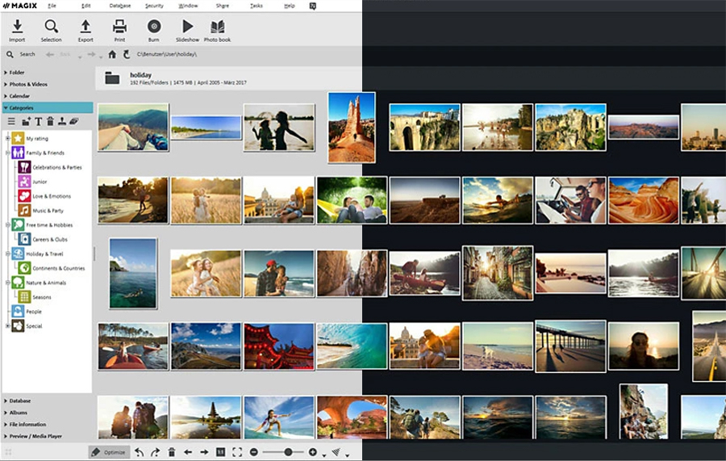
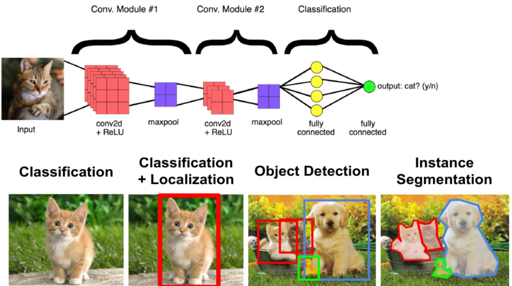
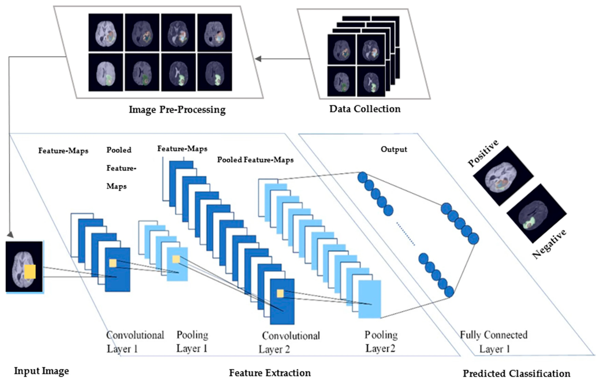

   
   
   
   
  

# Proyecto 01 — Agente de Limpieza Inteligente de Fotos (ALIF)

🎯 Objetivo del proyecto
Automatizar la limpieza y organización de fotos en dispositivos personales mediante un agente que:

detecta rostros,

identifica capturas de pantalla,

elimina fotos borrosas,

detecta duplicados,

clasifica imágenes,

y genera reportes automáticos.

🧠 Qué resuelve
La acumulación de basura digital:

capturas de pantalla sin valor,

fotos borrosas,

duplicados,

imágenes sin rostro,

contenido irrelevante.

ALIF elimina la necesidad de revisar manualmente miles de fotos.

🏗 Arquitectura del sistema
Módulo de ingesta → recibe imágenes

Módulo de análisis IA → visión por computador

Motor de reglas → decide qué hacer

Módulo de acciones → mover, eliminar, conservar

Registro y reportes → trazabilidad completa

🔄 Flujo técnico
Trigger → Análisis IA → Motor de reglas → Acción → Log → Reporte

⚙️ Reglas aplicadas
Sin rostro → posible eliminación

Captura de pantalla → mover a Screenshots

Borrosa → eliminar

Duplicada → conservar la mejor versión

Texto importante → mover a Documentos

📊 Impacto
Ahorro de tiempo

Reducción de memoria ocupada

Organización automática

Menos tareas repetitivas

Mayor claridad en la gestión de fotos

📁 Archivos del proyecto
Diseño del agente

Arquitectura del sistema

Flujo técnico

Pipeline

Documentación final

🚀 Estado del proyecto
ALIF está documentado al nivel profesional y listo para implementación en:

n8n

Make

Python + APIs de visión

Panel Streamlit

